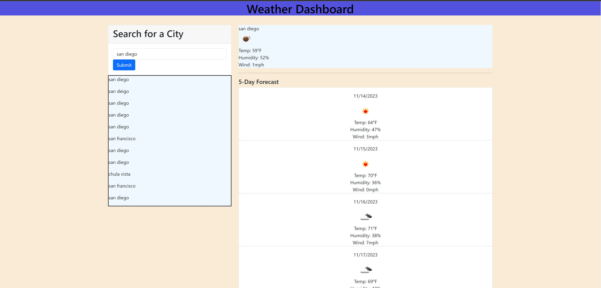

# Weather-City

## Description
This challenge was very difficult for me, but after messing around with the fetch call function i was able to grasp the concept so much more. In this project we focused on creating a weather appilication which would get weather data from the openweatherapi, and use that data to implement this website where you can get weather details from different cities
## Usage
This image demostrates the web application appearance and fuctionality

## Credits
I used the activites in the UCSD folder to help me with this project as well as the help of a tutor. 
N/A

## Features
Gets users input from search bar and converts that city to retrieve the weather from openweatherapi

## Deployed Application
https://aserrano7.github.io/Weather-City/